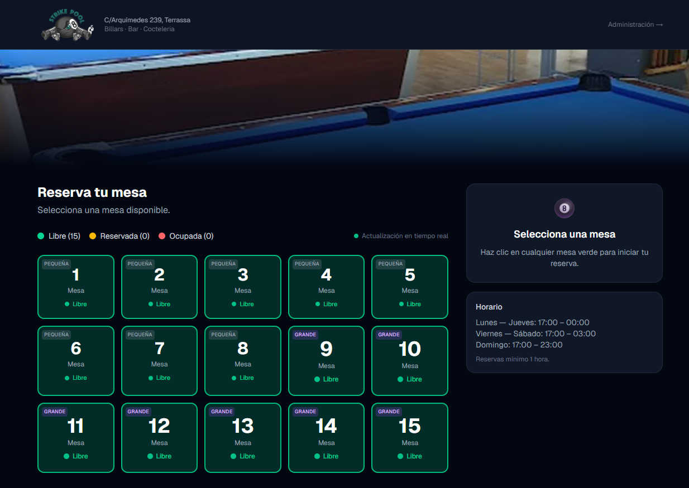

<div align="center">

# Strikepool 🎱

**Table reservation system for a billiard bar**


[](https://strikepool.vercel.app/)

</div>

---



---

## Overview

Strikepool is a real client project built for a billiard bar in Terrassa, Spain. Customers can see table availability in real time and book a table directly from their phone. Owners manage everything from a protected admin panel — reservations, time blocks, and weekly scheduling.

## Features

- **Real-time availability** — Supabase Realtime keeps the table grid live across all connected clients
- **Table reservation flow** — select a free table, pick a time slot, confirm via email
- **Email confirmations & reminders** — automated emails via Resend, 1 hour before the reservation
- **Admin panel** — manage reservations, block time slots, view weekly calendar
- **Route protection** — `/admin` routes protected by Supabase Auth middleware
- **15 tables** — small and large pool tables, color-coded by status (free / reserved / occupied)

## Stack

| Layer | Technology |
|-------|-----------|
| Framework | Next.js 16 (App Router) |
| Language | TypeScript |
| Database + Auth | Supabase (PostgreSQL + Realtime) |
| Email | Resend |
| Styling | Tailwind CSS |
| Hosting | Vercel |

## Local Development

```bash
git clone https://github.com/DavidSerret/strikepool.git
cd strikepool
npm install
cp .env.local.example .env.local
# Fill in Supabase and Resend credentials
npm run dev
```

- Customer view: [http://localhost:3000](http://localhost:3000)
- Admin panel: [http://localhost:3000/admin](http://localhost:3000/admin)

## Environment Variables

| Variable | Description |
|----------|-------------|
| `NEXT_PUBLIC_SUPABASE_URL` | Supabase project URL |
| `NEXT_PUBLIC_SUPABASE_ANON_KEY` | Supabase anonymous key |
| `RESEND_API_KEY` | Resend API key |
| `RESEND_FROM_EMAIL` | Verified sender email |
| `NEXT_PUBLIC_APP_URL` | Public app URL (no trailing slash) |

## Database

Run `supabase/schema.sql` in the Supabase SQL editor to set up the full schema. Then create an admin user via **Authentication → Users → Invite user**.

---

<div align="center">
  <a href="https://strikepool.vercel.app/">Live ↗</a> · <a href="https://github.com/DavidSerret">@DavidSerret</a>
</div>
